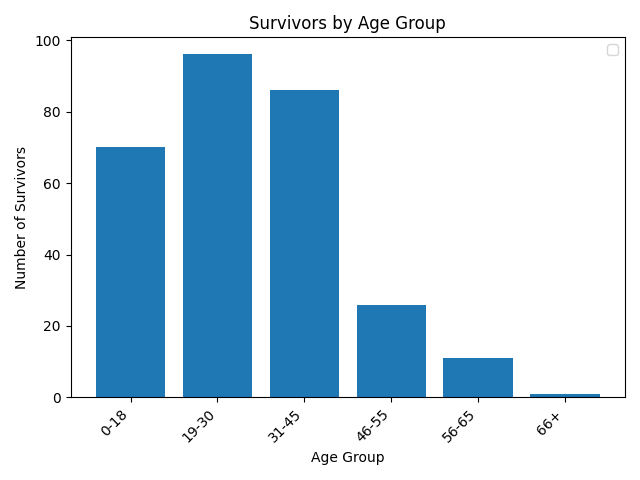

# titanic-data-analysis
Analysis of the survival of the Titanic passagers with plot graphs.

Hypothesis : the priority for lifeboats embarkation were probably as follows. Woman and children first! Then the riches. Forget about third class and old people.

## Data Source
https://www.agentsfordata.com/csv/sample

## Dependencies
- pandas
- numpy
- matplotlib

## Plots

