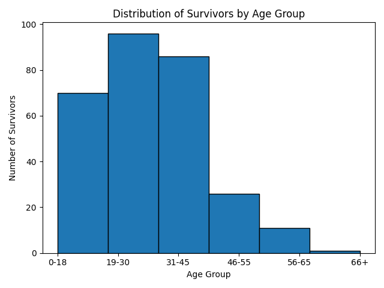
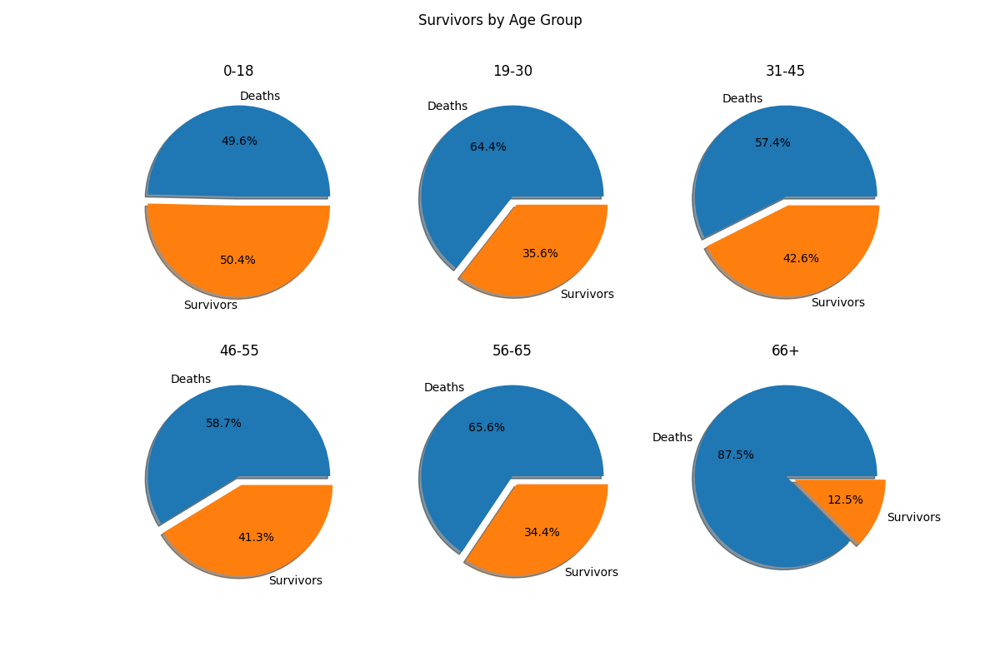
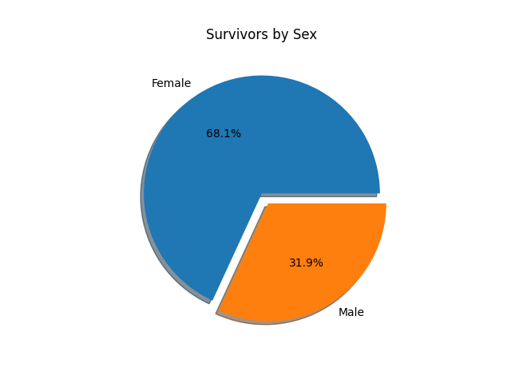

# titanic-data-analysis
Analysis of the survival of the Titanic passagers with plot graphs.

Visualizations were generated based on survival rate analysis across three dimensions: age group, sex, and passenger class.

## Hypothesis
The analysis examines the hypothesis that lifeboat boarding priority followed a hierarchical pattern: women and children were prioritized first, followed by first-class passengers, with lower survival rates expected among third-class passengers and elderly individuals.

### Survival rates by age group will display :

```
           total_survived  total_count survival_percentage
age_group
0-18                   70          139                 50%
19-30                  96          270                 36%
31-45                  86          202                 43%
46-55                  26           63                 41%
56-65                  11           32                 34%
66+                     1            8                 12%
```
It is important to note that some of the data related to the age of the passengers was missing. The percentage of missing values in Age column of this dataset is: 19.87%. Nearly a fifth of passengers are excluded from this part of the analysis.

### Survival rates by sex will display :

```
        total_survived  total_count survival_percentage
Sex
female             233          314                 74%
male               109          577                 19%
```

### Survival rates by class

```
        total_survived  total_count survival_percentage
Pclass
1                  136          216                 63%
2                   87          184                 47%
3                  119          491                 24%
```

### Conclusion
The analysis reveals that female passengers experienced substantially higher survival rates (74%) compared to males (19%). Among age groups, children (0-18 years) demonstrated the highest survival percentage at 50%. Furthermore, first-class passengers exhibited significantly greater survival rates (63%) compared to second-class (47%) and third-class passengers (24%).

## Data Source
https://www.agentsfordata.com/csv/sample

## Dependencies
- pandas
- numpy
- matplotlib

## Charts
<u>Histogram:</u>



<u>Pie charts:</u>





<u>Bar chart:</u>

